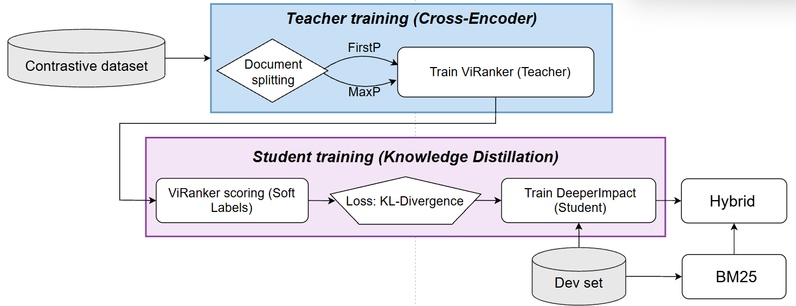
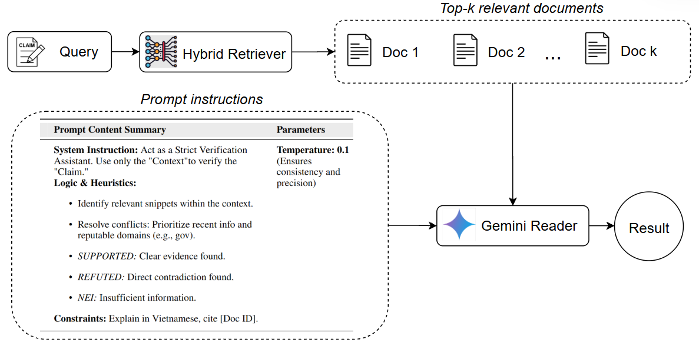

# ViRAG4FC: Vietnamese Information Retrieval & Generation for Fact-Checking

ViRAG4FC is an advanced, two-stage Information Retrieval (IR) and Retrieval-Augmented Generation (RAG) framework designed to address data scarcity and semantic ambiguity in Vietnamese fact-checking. 

The system utilizes a **Hybrid Retrieval** strategy—integrating lexical precision (BM25) with semantic learned indexing (DeeperImpact)—and leverages **Gemini 2.5 Flash** for final evidence-based reasoning. In this architecture, **ViRanker** (an XLM-RoBERTa based model) serves as the fundamental base model for the DeeperImpact retrieval stage.

## 🏗️ System Architecture

The pipeline is designed to ensure that fact-checking verdicts are grounded in highly relevant, retrieved evidence through a unified retrieval-verification approach.

1. **Data Augmentation & Filtering**

The system uses Gemini to generate multi-view query triples (Keyword, Natural, and Semantic) to enrich training data. These queries undergo strict lexical filtering (thresholding at 0.5 overlap) and hard negative mining via BM25 to ensure robust contrastive learning.

2.  **Semantic Learned Indexing (DeeperImpact powered by ViRanker)**

Unlike traditional pipelines where a cross-encoder acts as a final filter, this system uses **ViRanker** as the base architecture for **DeeperImpact**. This allows the model to:

- Perform semantic term expansion and weighting directly within the index.
- Capture deep semantic relevance between claims and documents during the initial retrieval phase.
- Efficiently retrieve documents using a learned-index approach fine-tuned on Vietnamese linguistic features.

<p align="center">
  
</p>

3. **Hybrid Retrieval & Reasoning**

A weighted alpha combines the scores from lexical (**BM25**) and semantic (**DeeperImpact**) branches. The Reader module (**Gemini 2.5 Flash**) then performs zero-shot reasoning over the top-K retrieved documents to provide the final verdict: **Supported**, **Refuted**, or **Not Enough Information**.

<p align="center">
  
</p>

## 📂 Repository Structure

The core logic resides in the `src` directory:

```text
src/
├── scripts/                # Core execution scripts
│   ├── rag_inference.py    # Main entry point for the RAG pipeline
│   ├── score_hybrid.py     # Script to combine BM25 and DeeperImpact scores
│   ├── reader_llm.py       # Wrapper for Gemini API with Vietnamese prompting
│   └── ...                 # Data handling and training scripts
├── notebooks/
│   └── Main Pipeline/      # Step-by-step workflow for the entire project
├── utils/                  # Configuration and helper utilities
└── others/                 # Static assets and diagrams
```

## 🔄 Main Pipeline Workflow

The project's end-to-end workflow is documented in `src/notebooks/Main Pipeline/`. Follow these steps to reproduce or extend the system:

1. [**Filter and Mine Hard Negatives**](src/notebooks/Main%20Pipeline/filter_and_mine_hard_negatives.ipynb): Preprocesses the corpus and mines hard negatives to prepare the training environment.

2. [**Train ViRanker**](src/notebooks/Main%20Pipeline/train_viranker_maxp.ipynb): Trains the base model using contrastive learning on mined triples to establish the foundation for semantic weighting.

3. [**Retrain DeeperImpact**](src/notebooks/Main%20Pipeline/retrain_deeperimpact.ipynb): Integrates semantic expansions and fine-tunes the learned index using the ViRanker-based architecture.

4. [**Run Hybrid Inference**](src/notebooks/Main%20Pipeline/run_hybrid_with_reader_llm.ipynb): Executes the full inference pipeline, merging retrieval results for final Gemini-based verification.

## 🚀 Quickstart

### Prerequisites
- **Python 3.9+**
- **Java 11+** (Required for Pyserini/BM25)
- **Gemini API Key** (Set as `GEMINI_API_KEY` environment variable)

### Installation
```bash
git clone https://github.com/tommachilez/virag4fc.git
cd virag4fc
pip install -r requirements.txt
```

### Running Inference
To run inference on a retrieval run file (e.g., from BM25 or DeeperImpact), use the following command from the project root:

```bash
python -m src.scripts.rag_inference \
    --run_file path/to/run_file.txt \
    --doc_mapping path/to/unique_doc_mapping.csv \
    --query_mapping path/to/test_query_mapping.csv \
    --label_file path/to/test_set_with_labels.csv \
    --output_dir results/output_folder \
    --api_key YOUR_GEMINI_KEY \
    --top_k 3
```

## 📊 Benchmarks

We unified three Vietnamese datasets (**ViFactCheck**, **ViWikiFC**, and **ViNumFCR**) into a comprehensive 34,811-sample benchmark.

| Retriever + Reader | Accuracy | Macro F1 |
| :--- | :--- | :--- |
| DeeperImpact + Gemini | 69.73% | 0.69 |
| **Hybrid + Gemini (Ours)** | **76.62%** | **0.77** |

## 📚 Datasets Used

This project utilizes the following benchmark datasets for Vietnamese fact-checking:

1. **ViFactCheck**: Hoa, Tran Thai, Tran Quang Duy, Khanh Quoc Tran, and Kiet Van Nguyen. "ViFactCheck: A New Benchmark Dataset and Methods for Multi-domain News Fact-Checking in Vietnamese." In Proceedings of the AAAI Conference on Artificial Intelligence, vol. 39, no. 1, pp. 308-316. 2025.
2. **ViWikiFC**: Le, Hung Tuan, Long Truong To, Manh Trong Nguyen, and Kiet Van Nguyen. "Viwikifc: Fact-checking for Vietnamese Wikipedia-based textual knowledge source." arXiv preprint arXiv:2405.07615 (2024).
3. **ViNumFCR**: Luong, Nhi Ngoc Phuong, Anh Thi Lan Le, Tin Van Huynh, Kiet Van Nguyen, and Ngan Nguyen. "ViNumFCR: A Novel Vietnamese Benchmark for Numerical Reasoning Fact Checking on Social Media News." In Proceedings of the 18th International Natural Language Generation Conference, pp. 134-147. 2025.

## 📄 License
This project is licensed under the MIT License. See the `LICENSE` file for details.

## 🤝 Contributions & Contact
Contributions are welcome! For questions or feedback, please contact me at `michael.nguyenbathong@gmail.com`.

## 🔗 Related Repositories
- DeepImpact Implementation: https://github.com/Tommachilez/improving-learned-index.git